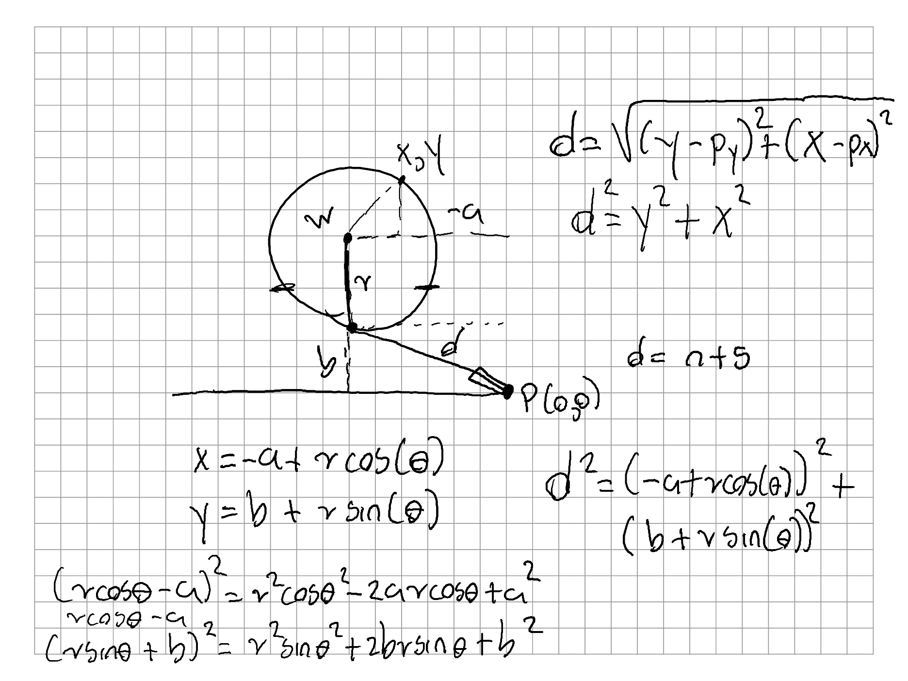
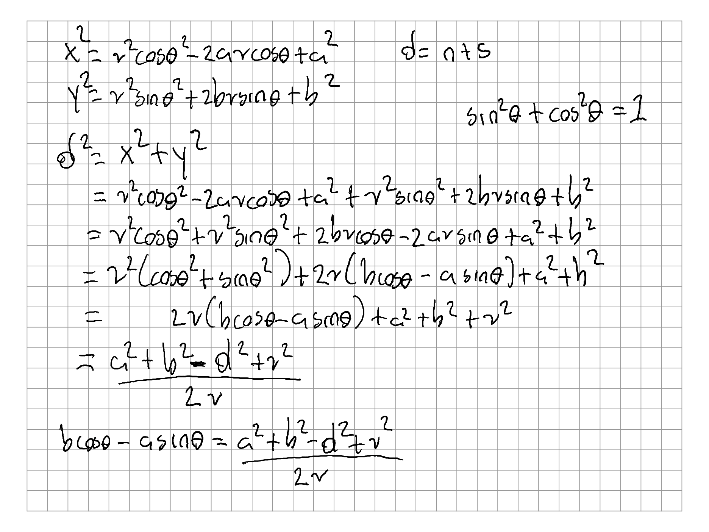
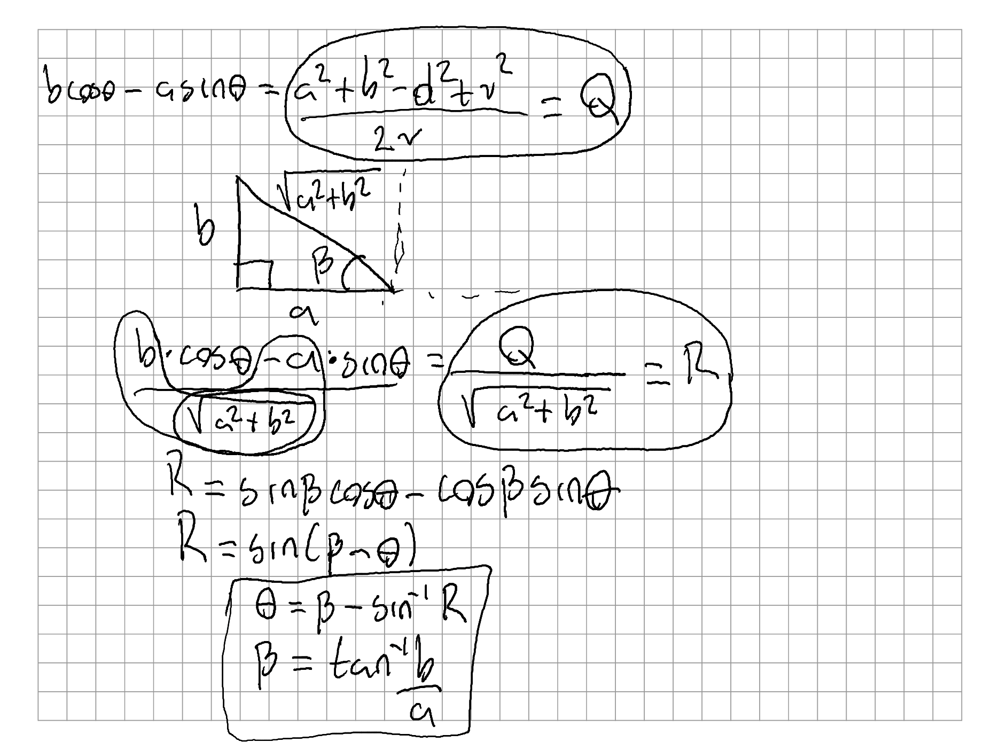

# Challenge 1

## Approach problem summary

My initial thoughts in solving this problem is to use the circle parametric equations to relate a x and y point in the circunference of the circle to the distance measured by the piston using the Euclidean distance. The circle is created by the rotation of the wheel.

## Written notes of the solution

The following three images describe the calculations I come up with the equation to calculate the theta angle.







## Installation

* The script can run on any OS(Windows, MacOS, Linux, etc.) with Python 3.* installed.

### Install dependencies

```bash
pip install numpy
pip install math
```

## Usage

Move to the challenge 1 directory.
```bash
cd ~/worktest/challenge_1
```

Run the script in the following way:
```bash
python linear_sensor_to_steering_angle.py x
```
where 'x' is the measurement of the piston in inches.

## Details about the implementation

## License
[MIT](https://choosealicense.com/licenses/mit/)