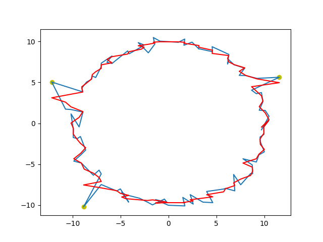

# Challenge 2

## Approach problem summary

My initial thoughts in solving this problem is to try to solve it by applying one of the common methods of smoothing: Savitzky-Golay filter.

## Installation

* The script can run on any OS(Windows, MacOS, Linux, etc.) with Python 3.* installed.

### Install dependencies

```bash
pip install numpy
pip install math
pip install random
pip install matplotlib
pip install scipy
pip install json
```

## Usage

Move to:
```bash
cd ~/worktest/challenge_2
```

Run without json file:
```bash
python preprocess_coordinates.py
```

Run wit json file:
```bash
python preprocess_coordinates.py region.json
```

## Details about the implementation

- If not json file provided, generates points of a circle with specified radius with noise for the 'x' and 'y' coordinates. Also, injects a number of specified outliers to the data.
- Uses the savgol_filter from scipy.signal.

## Results

I'm providing two images of two running tests I did.

The first image is without using the json file provided but instead a series of `x` and `y` coordinates for the circunference of a circle with added noisy and three outliers injected:



The following image is with using the json file provided:


## License
[MIT](https://choosealicense.com/licenses/mit/)